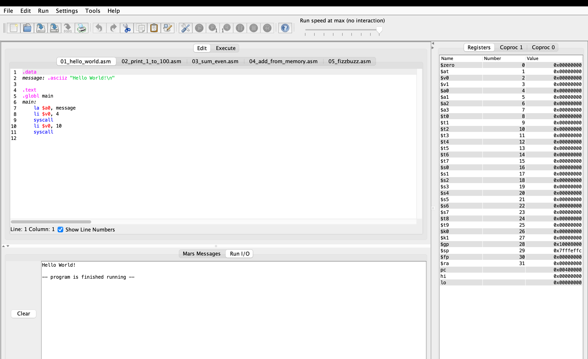
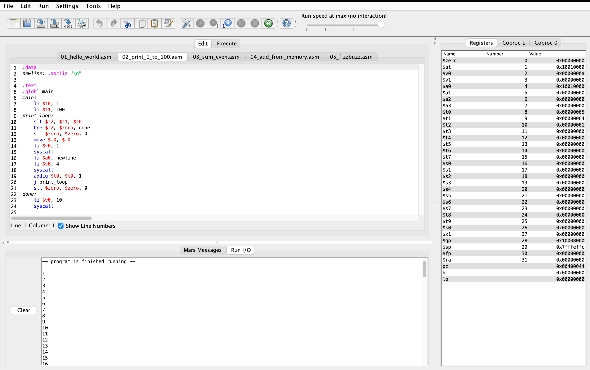
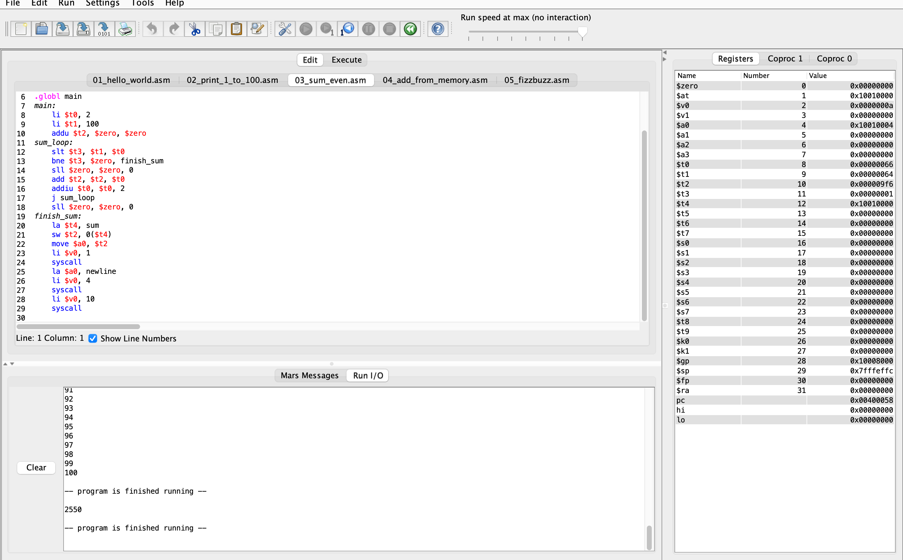
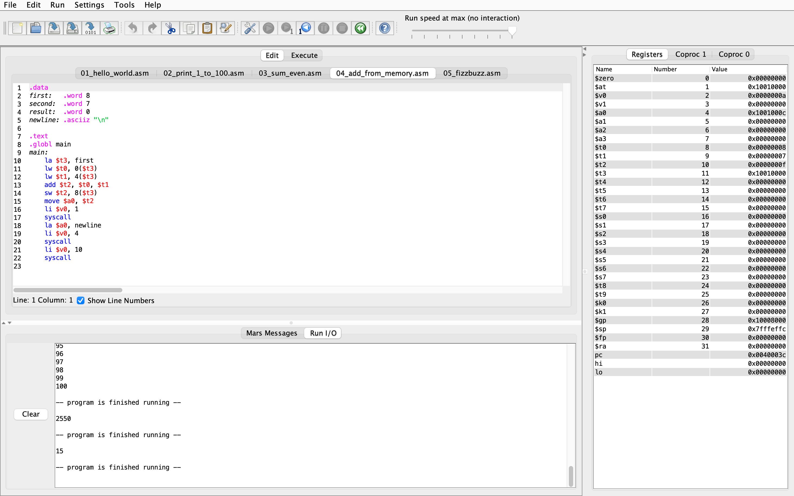
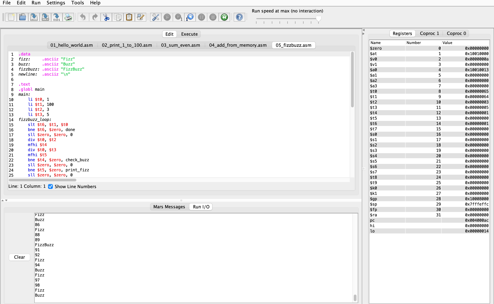

# Assignment 3: MARS Fundamentals

Four main programs and a Hello World setup exercise for MARS 4.5.

| File | Result |
| --- | --- |
| `01_hello_world.asm` | Hello World! |
| `02_print_1_to_100.asm` | Integers 1 through 100 |
| `03_sum_even.asm` | Even sum: 2550 |
| `04_add_from_memory.asm` | Loads 8 and 7, stores 15 |
| `05_fizzbuzz.asm` | FizzBuzz for 1 through 100 |

## Running

Download [MARS 4.5 from its official repository](https://github.com/dpetersanderson/MARS/releases) and install Java. Launch MARS with `java -jar Mars4_5.jar`. Open one `.asm` file at a time, select **Run > Assemble**, then **Run > Go**. Enable pseudo-instructions; use Default memory configuration and delayed branching off for the report traces. **Run > Step** shows register and memory changes.

## Verification

Complete outputs were verified using the official MARS simulator. Tests included loop bounds 0, 1, 2, 99, and 100; zero and negative memory inputs; signed 32-bit limits and expected overflow; all four FizzBuzz cases; and delayed branching on and off.

`Assignment3_Report.pdf` includes full output, recorded MARS register/memory traces, tests, and a reflection draft to personalize. GUI screenshots are included below. They show source code and captured Run I/O; the PDF contains the step-by-step register and memory traces.

## Sources and collaboration

Instructor Dominic Dabish's CS240 Thursday examples `mips1.asm` through `mips15.asm` informed the memory, syscall, and loop patterns. MARS was developed by Pete Sanderson and Kenneth Vollmar. OpenAI Codex assisted with program preparation, testing, trace capture, and report drafting. Review the work and follow the course collaboration policy before submission.

## MARS screenshots

### Hello World

### Print 1 through 100

### Even sum: 2550

### Memory addition: 15

### FizzBuzz

